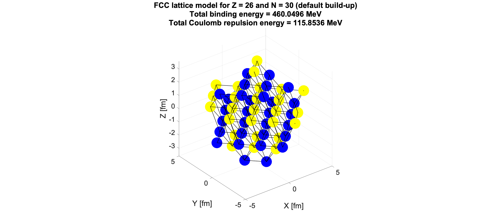
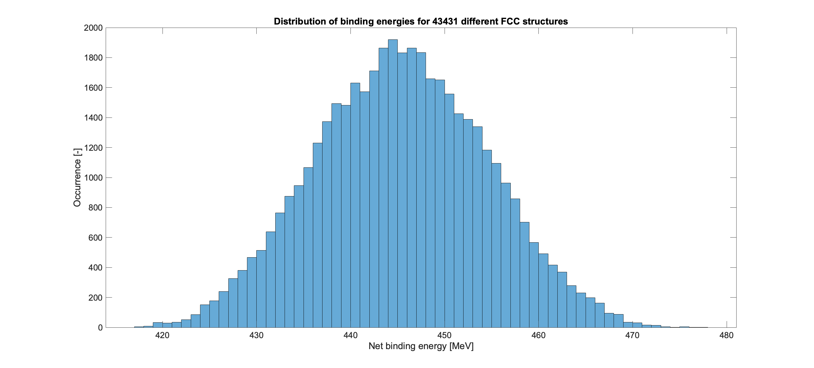
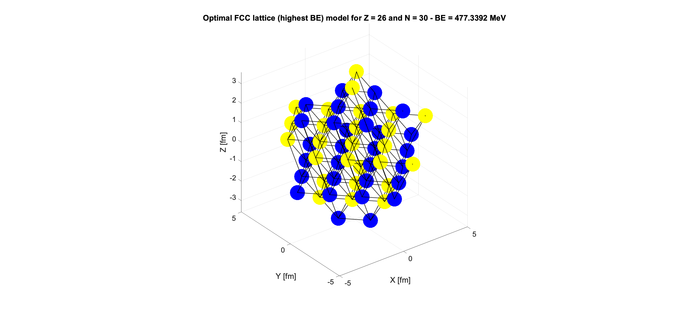
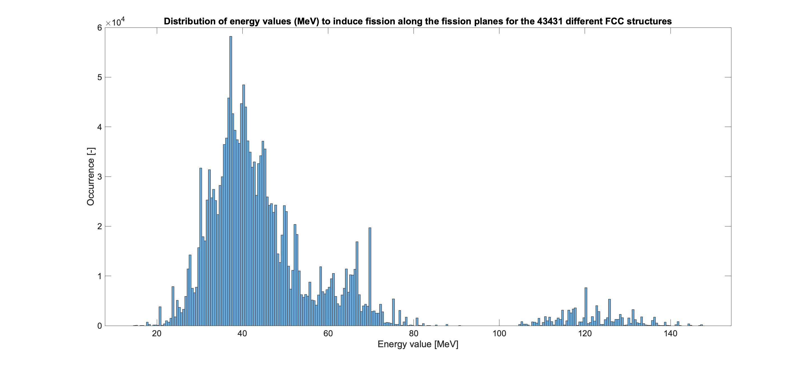
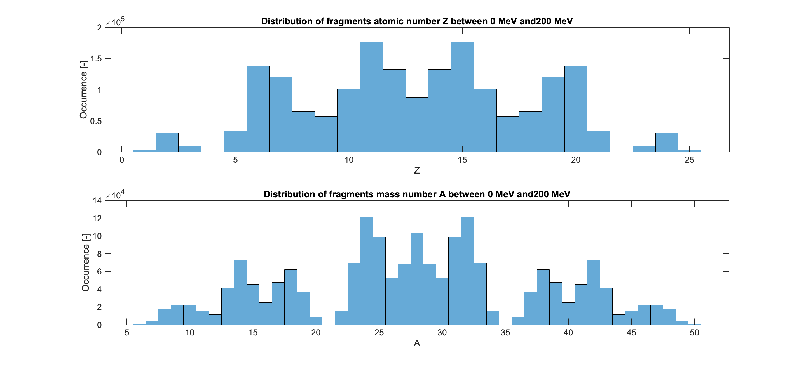
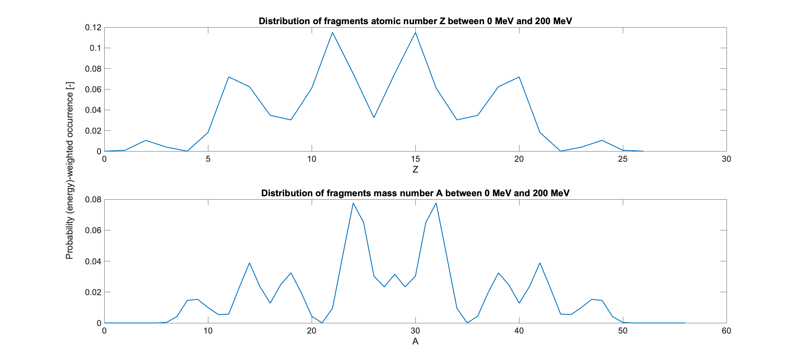
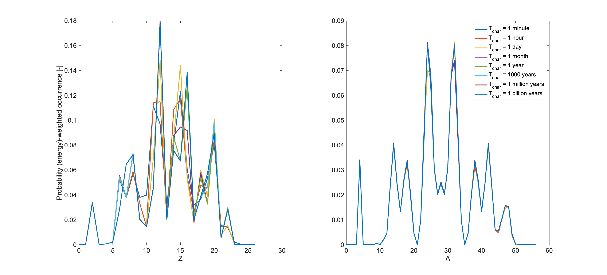

# FCC nuclear structure
This Matlab code contains an adaptation of the Face-Centered-Cubic (FCC) lattice model proposed by Norman D. Cook ("Models of the Atomic Nucleus: Unification Through a Lattice of Nucleons", 2nd Edition, 2010) for visualizing and modeling the structures of atomic nuclei.

The code contains an interactive interface to insert input data and it will allow you to: generate a default FCC structure for a certain nucleus; consider a randomization of the positions of external nucleons to obtain an array of feasible FCC structures with different energetics; carry out a fission analysis, by fracturing the nucleus along specific crystallographic planes and obtain fission energy; study the statistics of fission fragments, also including energy-based weighting; take also into account the nuclear decay of unstable fission fragments at different times of observation.

Instructions:

First, you will be asked which nucleus you want to analyze. Specify the number of protons (Z) and neutrons (N). For example, in case of Fe56, you type Z = 26 and N = 30. Following the default build-up proposed by N.D. Cook, the code will place all protons and neutrons in the proper FCC positions and calculate basic features such as Coulomb repulsion, spin and Binding Energy (BE).

Then the code will carry out a randomization of the positions of the nucleons lying on the external surface. You will be asked - for both protons and neutrons - which are the minimum and maximum n-values defining the borders of the shell layers where nucleon positions can change randomly. The code will then generate thousands of randomized FCC structures, retaining only those that have the same spin as the default build-up and that do not exhibit disconnected nucleons. For example, inserting n = 1 and n = 4 as minimum and maximum n-values for  protons and neutrons for Fe56, one obtains 43,431 feasible structures, with BE values ranging from ~417 MeV to ~477 MeV.

The code will also provide a picture of the randomized FCC structure with the highest BE (in this case, ~477 MeV).

Then, you can perform the fission analysis. The code will carry out fission calculations by fracturing each of the FCC models along 21 crystallographic planes of the lattice. This will generate a list of fragments, associated to Z, N, A numbers, Coulomb repulsion, and energy values needed to break the first-neighboring bonds. Note: for very small nuclei you might need to reduce the number of crystallographic planes (or adjust your fragment list a-posteriori), since some of these planes might lie outside the outer surface of the nucleus and will not generate fragments.

The code will then plot a histogram distribution of fission energies, e.g. for Fe56 these are found to range from ~15 MeV to ~147 MeV, with peaks around ~40 MeV.

Then, you can select an energy range (in MeV) to carry out further statistical analysis of the fragments, in terms of occurrence for atomic and mass number. For example, selecting 0-200 MeV for our example of Fe56, we obtain:

The code also automatically weight such occurrence based on the fission energy, i.e. fragments associated with lower fission energy are more likely to prevail. Note: it can happen that certain fragments are associated with zero fission energy (perfect balance between Coulomb repulsion and bond-breaking energy), or negative energy (Coulomb repulsion higher than breaking energy). In these cases, you might want to adjust the calculation for energy-based weighting, providing a positive energy shift so that you do not deal with zero- or negative-energy values during the probability calculation.

Finally, since most of the generated fragments are highly unstable, the code also allows you to take into account the decay into stable nuclei. This calculation is carried out based on the half-lives of every (Z,N) couple reported in the NUBASE2020 database (10.1088/1674-1137/abddae) and saved in the "Nuclear_stability.xlsx" file, and based of the characteristic time (T_char) of our observation, e.g. after 1 minute, 1 hour, 1 day, etc. Note that also here, if you are dealing with zero or negative fission energy values, you might want to adjust the probability calculation, as explained above.

